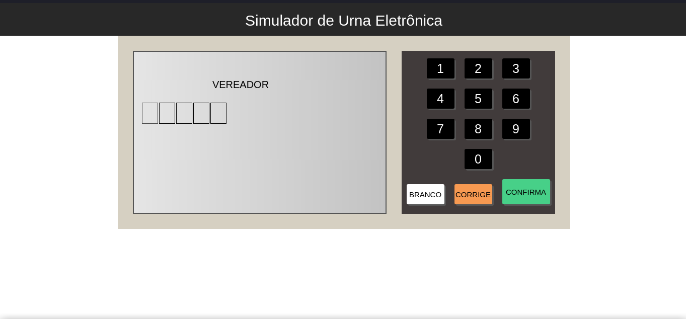

# Projetos Javascript
3 projetos formados com JavaScript puro realizados durante uma live do professor Bonieky Lacerda da B7 Web.

Página para os projetos: https://mateusgs29.github.io/3-projetos-javascript/

# Urna Eletrônica
Simulador de uma urna eletrônica brasileira de uma eleição fictícia de Vereadores e Prefeitos. 

Link: https://mateusgs29.github.io/3-projetos-javascript/urna/index.html

# Slider Show
Slider de fotos das 7 maravilhas do mundo. Tem 3 botões para gerenciar os slides: Um para pausar ou dar play na passagem automática da imagem e outros dois para troca-la.

Link: https://mateusgs29.github.io/3-projetos-javascript/slidershow/index.html

# Validador de formulário
Um validador de formulário que ao clicar no botão de Cadastrar ele valida os campos necessários de acordo com suas regras pré-definidas.

Link: https://mateusgs29.github.io/3-projetos-javascript/form/index.html